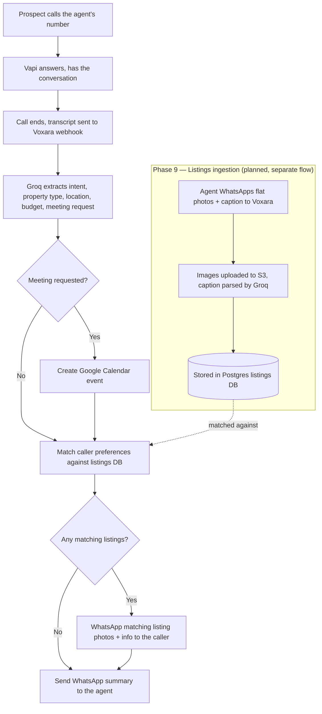

# Voxara

AI call assistant for real estate agents. Voxara answers a prospect's call, has
the conversation, then automatically sends the agent a WhatsApp summary and
creates a Google Calendar event if a meeting was requested.

## Overview

A prospect calls the agent's number. [Vapi](https://vapi.ai) answers and holds
the conversation. When the call ends, Vapi posts the transcript to Voxara,
which uses Groq (Whisper for STT, LLaMA for extraction) to pull out structured
details — intent, property type, location, budget, bedrooms, and whether a
meeting was requested. Voxara then creates a Google Calendar event if needed
and WhatsApps the agent a formatted summary, so the agent never has to listen
to a recording or read a raw transcript.

A planned extension (**Phase 9**, see [Architecture](#architecture)) lets the
agent WhatsApp property listings (photos + caption) to Voxara once; on future
calls, Voxara matches caller preferences against those listings and WhatsApps
matching photos directly to the caller.

## Architecture



The core pipeline (`A`–`G`, minus the listings detour) is a 5-node
[LangGraph](https://github.com/langchain-ai/langgraph) state machine —
see `app/graph/voxara_graph.py`. Phase 9 slots in as two additional nodes
(`match_listings`, `send_listings`) between the meeting branch and the
agent's summary, without changing the existing routing logic.

**Build status** — see `voxara_agent_prompts.md` for the full phase-by-phase spec:

| Phase | What | Status |
|---|---|---|
| 1 | Project scaffold & environment | ✅ done |
| 2 | Groq service (STT + LLM) | ✅ done |
| 3 | WhatsApp & Google Calendar services | ✅ done |
| 4 | LangGraph agents & state machine | ⬜ not started |
| 5 | Vapi webhook & FastAPI server | ⬜ not started |
| 6 | Vapi assistant configuration | ⬜ not started |
| 7 | End-to-end testing | ⬜ not started |
| 8 | Production hardening & deployment | ⬜ not started |
| 9 | Listings intelligence extension | ⬜ planned (design approved, not built) |

## Quick Start

```bash
python -m venv .venv
.venv\Scripts\activate        # Windows; use `source .venv/bin/activate` on macOS/Linux
pip install -r requirements.txt
cp .env.example .env          # then fill in real credentials, see below
uvicorn app.main:app --reload --port 8000
```

`GET http://localhost:8000/health` should return `{"status": "ok"}` once Phase 5 is built.

## Environment Variables

| Key | Description |
|---|---|
| `GROQ_API_KEY` | Groq API key — powers Whisper STT and LLaMA extraction |
| `VAPI_API_KEY` | Vapi account API key |
| `VAPI_PHONE_NUMBER_ID` | Vapi phone number ID to assign the assistant to |
| `VAPI_ASSISTANT_ID` | Filled in automatically by `scripts/setup_vapi_assistant.py` |
| `VAPI_WEBHOOK_SECRET` | Shared secret Vapi sends back on webhook calls; checked in `/webhook/vapi` |
| `TWILIO_ACCOUNT_SID` / `TWILIO_AUTH_TOKEN` | Twilio account credentials |
| `WHATSAPP_FROM_NUMBER` | Twilio WhatsApp sender number (sandbox default: `whatsapp:+14155238886`) |
| `AGENT_WHATSAPP_NUMBER` | The real estate agent's own WhatsApp number — receives call summaries |
| `GOOGLE_CLIENT_ID` / `GOOGLE_CLIENT_SECRET` | Google Cloud OAuth client, for Calendar access |
| `GOOGLE_REDIRECT_URI` | OAuth callback URL (`http://localhost:8000/auth/google/callback` locally) |
| `GOOGLE_REFRESH_TOKEN` | Obtained once via the `/auth/google` flow, then reused |
| `PORT` | Port the FastAPI server listens on (default `8000`) |
| `ENV` | `development` or `production` — controls logging format (see `app/utils/logger.py`) |

## Google OAuth Setup

1. Create OAuth credentials (Web application) in the Google Cloud Console, with
   `GOOGLE_REDIRECT_URI` as an authorized redirect URI.
2. Put the client ID/secret in `.env`.
3. Once Phase 5's server is running, visit `/auth/google`, complete consent,
   and exchange the returned code for a refresh token — save it as
   `GOOGLE_REFRESH_TOKEN`.

## Vapi Assistant Setup

```bash
python scripts/setup_vapi_assistant.py    # creates the assistant, saves VAPI_ASSISTANT_ID
python scripts/assign_phone_number.py     # assigns it to your Vapi phone number
```

## WhatsApp Setup via Twilio

For development, join the Twilio WhatsApp Sandbox and set `WHATSAPP_FROM_NUMBER`
to the sandbox number. For production, use an approved WhatsApp Business sender.

## Running Locally with ngrok

```bash
uvicorn app.main:app --reload --port 8000
ngrok http 8000
# copy the https URL into the Vapi assistant's serverUrl
```

## Running with Docker

```bash
docker build -t voxara .
docker-compose up
```

## Running Tests

```bash
pytest
```

## Troubleshooting

- **Import errors on startup** — confirm `.venv` is activated and
  `pip install -r requirements.txt` completed with zero errors.
- **Webhook returns 401** — `VAPI_WEBHOOK_SECRET` in `.env` must match what's
  configured on the Vapi assistant.
- **WhatsApp send fails** — Twilio's WhatsApp sandbox requires the recipient
  number to have joined the sandbox first; free-form messages outside a 24h
  session window will fail for any number that hasn't messaged in.
- **Calendar event not created** — check `GOOGLE_REFRESH_TOKEN` is set; it's
  only obtained after completing the `/auth/google` flow once.
