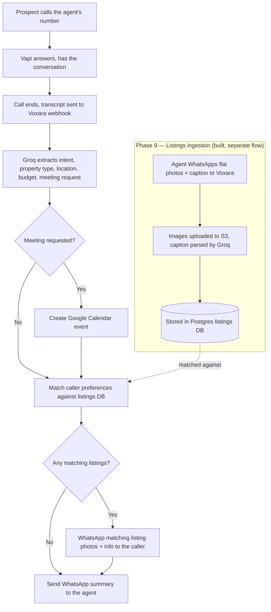

# Voxara

AI call assistant for real estate agents. Voxara answers a prospect's call, has
the conversation, then automatically sends the agent a WhatsApp summary and
creates a Google Calendar event if a meeting was requested.

## Overview

A prospect calls the agent's number. [Vapi](https://vapi.ai) answers and holds
the conversation. When the call ends, Vapi posts the transcript to Voxara,
which uses Groq (Whisper for STT, LLaMA for extraction) to pull out structured
details — intent, property type, location, budget, bedrooms, and whether a
meeting was requested. Voxara then creates a Google Calendar event if needed
and WhatsApps the agent a formatted summary, so the agent never has to listen
to a recording or read a raw transcript.

**Phase 9** (see [Architecture](#architecture)) extends this: the agent
WhatsApps property listings (photos + caption) to Voxara once; on future
calls, Voxara matches caller preferences against those listings and WhatsApps
matching photos directly to the caller. The pipeline, Postgres wiring, and
tests are all built and verified — what's left before real traffic is an S3
bucket and an approved WhatsApp Content Template, both third-party account
setup that can't be done from code (see
[Phase 9](#phase-9--listings-intelligence-extension)).

## Architecture



The core pipeline (`A`–`G`, minus the listings detour) is a 5-node
[LangGraph](https://github.com/langchain-ai/langgraph) state machine —
see `app/graph/voxara_graph.py`. Phase 9 slots in as two additional nodes
(`match_listings`, `send_listings`) between the meeting branch and the
agent's summary, without changing the existing routing logic.

**Build status** — see `voxara_agent_prompts.md` for the full phase-by-phase spec:

| Phase | What | Status |
|---|---|---|
| 1 | Project scaffold & environment | ✅ done |
| 2 | Groq service (STT + LLM) | ✅ done |
| 3 | WhatsApp & Google Calendar services | ✅ done |
| 4 | LangGraph agents & state machine | ✅ done |
| 5 | Vapi webhook & FastAPI server | ✅ done |
| 6 | Vapi assistant configuration | ✅ done |
| 7 | End-to-end testing | ✅ done |
| 8 | Production hardening & deployment | ✅ done |
| 9 | Listings intelligence extension | ✅ built & tested — see [Phase 9](#phase-9--listings-intelligence-extension) |

## Quick Start

```bash
python -m venv .venv
.venv\Scripts\activate        # Windows; use `source .venv/bin/activate` on macOS/Linux
pip install -r requirements.txt
cp .env.example .env          # then fill in real credentials, see below
uvicorn app.main:app --reload --port 8000
```

`GET http://localhost:8000/health` should return `{"status": "ok"}`.

## Environment Variables

| Key | Description |
|---|---|
| `GROQ_API_KEY` | Groq API key — powers Whisper STT and LLaMA extraction |
| `VAPI_API_KEY` | Vapi account API key |
| `VAPI_PHONE_NUMBER_ID` | Vapi phone number ID to assign the assistant to |
| `VAPI_ASSISTANT_ID` | Filled in automatically by `scripts/setup_vapi_assistant.py` |
| `VAPI_WEBHOOK_SECRET` | Shared secret Vapi sends back on webhook calls; checked in `/webhook/vapi` |
| `TWILIO_ACCOUNT_SID` / `TWILIO_AUTH_TOKEN` | Twilio account credentials |
| `WHATSAPP_FROM_NUMBER` | Twilio WhatsApp sender number (sandbox default: `whatsapp:+14155238886`) |
| `AGENT_WHATSAPP_NUMBER` | The real estate agent's own WhatsApp number — receives call summaries |
| `GOOGLE_CLIENT_ID` / `GOOGLE_CLIENT_SECRET` | Google Cloud OAuth client, for Calendar access |
| `GOOGLE_REDIRECT_URI` | OAuth callback URL (`http://localhost:8000/auth/google/callback` locally) |
| `GOOGLE_REFRESH_TOKEN` | Obtained once via the `/auth/google` flow, then reused |
| `PORT` | Port the FastAPI server listens on (default `8000`) |
| `ENV` | `development` or `production` — controls logging format (see `app/utils/logger.py`) |
| `DATABASE_URL` | Listings DB connection string. Defaults to a local SQLite file (`sqlite:///./voxara.db`) so Phase 9 works with zero setup; point it at Postgres (`postgresql+psycopg2://...`) for docker-compose/production |
| `S3_ENDPOINT_URL` | Leave empty for real AWS S3; set for an S3-compatible provider (Cloudflare R2, MinIO, etc.) |
| `S3_ACCESS_KEY_ID` / `S3_SECRET_ACCESS_KEY` | Credentials for the listings image bucket |
| `S3_BUCKET_NAME` | Bucket that stores agent-uploaded listing photos |
| `S3_REGION` | Bucket region (default `us-east-1`) |
| `S3_PUBLIC_BASE_URL` | Public HTTPS base URL images are served from, e.g. `https://voxara-listings.s3.amazonaws.com` |
| `TWILIO_LISTING_TEMPLATE_SID` | Approved WhatsApp Content Template SID used to send matched listings to callers — filled in by `scripts/setup_whatsapp_template.py` |
| `MAX_LISTINGS_PER_MATCH` | Max listings sent to a caller per call (default `3`) |
| `LISTING_MATCH_MIN_SCORE` | Minimum match score (0-100) for a listing to be sent (default `40`) |

## Google OAuth Setup

1. Create OAuth credentials (Web application) in the Google Cloud Console, with
   `GOOGLE_REDIRECT_URI` as an authorized redirect URI.
2. Put the client ID/secret in `.env`.
3. Once Phase 5's server is running, visit `/auth/google`, complete consent,
   and exchange the returned code for a refresh token — save it as
   `GOOGLE_REFRESH_TOKEN`.

## Vapi Assistant Setup

```bash
python scripts/setup_vapi_assistant.py    # creates the assistant, saves VAPI_ASSISTANT_ID
python scripts/assign_phone_number.py     # assigns it to your Vapi phone number
```

## WhatsApp Setup via Twilio

For development, join the Twilio WhatsApp Sandbox and set `WHATSAPP_FROM_NUMBER`
to the sandbox number. For production, use an approved WhatsApp Business sender.

## Phase 9 — Listings Intelligence Extension

Turns Voxara from "just handles the call" into a listing library + matcher.
The agent WhatsApps property photos + a caption to Voxara once; Voxara stores
them. On every future call, once Voxara has extracted what the caller wants,
it matches those preferences against stored listings and WhatsApps matching
photos **directly to the caller**, on top of the existing agent-facing summary.

Full design rationale lives in `voxara_agent_prompts.md` (Phase 9 section).
All sub-steps are built and covered by tests; what remains is standing up
real infrastructure (Postgres, an S3 bucket, an approved WhatsApp template)
before it can run against live traffic:

| Step | What | Status |
|---|---|---|
| 9a | Database layer — `Listing` model, `db.py`, Alembic migration, Postgres in `docker-compose.yml` | ✅ done |
| 9b | Storage service — S3 upload + authenticated Twilio media download | ✅ done |
| 9c | Inbound WhatsApp webhook (agent uploads a listing) | ✅ done |
| 9d | Listing extraction — prompt, `groq_service.extract_listing_data`, budget parser | ✅ done |
| 9e | Matching logic + LangGraph integration (`match_listings`, `send_listings` nodes) | ✅ done |
| 9f | Outbound send — WhatsApp Content Template + `scripts/setup_whatsapp_template.py` | ✅ done |
| 9g | Tests for the above | ✅ done — 21 new tests across 3 files |

### How it slots into the graph

`match_listings` and `send_listings` sit between the meeting branch and the
agent's summary, so a single call can now trigger up to three outcomes:
a calendar event, a listings WhatsApp to the **caller**, and the summary
WhatsApp to the **agent**:

```
extract --(should_schedule_meeting)--> schedule_meeting / match_listings / END
schedule_meeting -> match_listings
match_listings --(should_send_listings)--> send_listings / send_whatsapp
send_listings -> send_whatsapp -> finalize -> END
```

`match_listings_node` only queries the DB when the call's intent is
`property_inquiry`/`site_visit_request` and a property type or location was
extracted — everything else short-circuits to an empty match list without
touching the database. `send_listings_node` degrades to
`{"success": False, "error": "NO_CALLER_NUMBER"}` rather than crashing when
Vapi didn't supply the caller's own number (web test calls, withheld caller ID).

### New files

- `app/models/listing.py` — the `Listing` SQLModel table
- `app/services/db.py` — SQLAlchemy session, kept sync + thread-executor-wrapped like every other service
- `app/services/storage_service.py` — S3 upload + authenticated Twilio media download
- `app/services/listing_service.py` — DB CRUD plus the pure, zero-mock-needed `match_listings()` scoring function
- `app/services/whatsapp_webhook_service.py` — inbound webhook orchestration (ack fast, process via `BackgroundTasks`)
- `app/agents/listing_agent.py` — `match_listings_node`, `should_send_listings`, `send_listings_node`
- `app/prompts/listing_prompt.py`, `app/utils/budget_parser.py`
- `app/utils/validators.py` — Twilio request-signature validation
- `alembic/` — one migration, `create_listings_table`
- `scripts/setup_whatsapp_template.py` — submits the Content Template, saves `TWILIO_LISTING_TEMPLATE_SID`
- `tests/test_listing_ingestion.py`, `tests/test_matching.py`, `tests/test_graph_listings.py`, `tests/conftest.py`

### Database setup

Phase 9 defaults to a local SQLite file (`sqlite:///./voxara.db`) so it works
with zero setup in development. For docker-compose/production, Postgres is
already wired up:

```bash
docker-compose up -d postgres
# then, with DATABASE_URL pointed at postgres in .env:
alembic upgrade head
```

Never run `alembic upgrade head` automatically inside the app container when
using multiple `uvicorn` workers — migrate as an explicit deploy step to avoid
concurrent-migration races.

### Object storage setup

Create an S3 (or S3-compatible — R2, MinIO, etc.) bucket for listing photos.
Modern buckets have ACLs disabled by default, so grant public read via a
**bucket policy scoped to the `listings/` prefix** rather than per-object ACLs.
Set `S3_BUCKET_NAME`, `S3_ACCESS_KEY_ID`, `S3_SECRET_ACCESS_KEY`, `S3_REGION`,
and `S3_PUBLIC_BASE_URL` in `.env` (and `S3_ENDPOINT_URL` if using a
non-AWS provider).

### WhatsApp Content Template setup (caller-facing sends)

Callers who've only phoned in — never WhatsApp'd — are outside Twilio's 24-hour
free-form messaging window, so listings sent to them **must** use a
pre-approved WhatsApp Content Template rather than a free-form message:

```bash
python scripts/setup_whatsapp_template.py   # submits the template, prints the ContentSid
```

Save the returned ID as `TWILIO_LISTING_TEMPLATE_SID`. Approval is manual and
out-of-band (Twilio Console/Content API → Meta review, hours-to-days) — submit
well before you need it live, since editing an approved template's body
requires re-approval.

### New endpoint

`POST /webhook/whatsapp/inbound` — Twilio's inbound WhatsApp webhook, used when
the agent sends a listing's photos + caption to Voxara's WhatsApp number.

## Running Locally with ngrok

```bash
uvicorn app.main:app --reload --port 8000
ngrok http 8000
# copy the https URL into the Vapi assistant's serverUrl
```

## Production Hardening (Phase 8)

- **Rate limiting** — `POST /webhook/vapi` (100/minute) and `POST /webhook/whatsapp/inbound`
  (20/minute) are both limited via `slowapi`, keyed by remote address, returning `429`
  once exceeded. **Caveat verified in practice**: the Docker image runs `uvicorn` with
  2 workers, and slowapi's default in-memory storage doesn't share state across worker
  processes — so the *effective* limit under `--workers N` is closer to `N ×` the
  configured number before every worker independently starts rejecting. Fine for a
  single-agent deployment; if you scale workers up meaningfully, point slowapi at a
  shared store (e.g. `Limiter(storage_uri="redis://...")`) instead.
- **Groq resilience** — `client = Groq(api_key=..., timeout=30.0)`; the sync helpers
  behind `transcribe_audio`, `extract_call_data`, and `extract_listing_data` all retry
  transient failures via `tenacity` (3 attempts, exponential backoff) before giving up.
- **Call-processing timeout** — `handle_vapi_webhook` wraps `process_call(...)` in
  `asyncio.wait_for(..., timeout=25)`; a stuck pipeline returns
  `{"status": "timeout", "errors": ["PROCESS_CALL_TIMEOUT"]}` instead of hanging the
  webhook response indefinitely.

## Running with Docker

```bash
docker build -t voxara .
docker-compose up -d
docker compose exec voxara alembic upgrade head   # explicit migration step, see below
```

`docker-compose.yml` runs two services: `voxara` (the app, built from the
`Dockerfile`, healthchecked via `curl http://localhost:8000/health`) and
`postgres` (16-alpine, with its own healthcheck) — `voxara` waits for
`postgres` to report healthy before starting, and its `DATABASE_URL` is
overridden in-compose to point at the `postgres` service hostname regardless
of what's in your local `.env`. Verified end-to-end: `docker build` completes
clean, both containers report healthy, `/health` returns `200` from the host,
and `alembic upgrade head` applies correctly against the containerized Postgres.

## Running Tests

```bash
pytest
```

25 tests across `tests/test_integration.py` (core pipeline), `tests/test_matching.py`
(budget parsing + listing scoring, no mocks needed), `tests/test_listing_ingestion.py`
(inbound webhook), and `tests/test_graph_listings.py` (full graph topology with
both the meeting and listings branches). `tests/conftest.py` creates the SQLite
schema once per test session so DB-touching paths don't need Postgres running locally.

## Troubleshooting

- **Import errors on startup** — confirm `.venv` is activated and
  `pip install -r requirements.txt` completed with zero errors.
- **Webhook returns 401** — `VAPI_WEBHOOK_SECRET` in `.env` must match what's
  configured on the Vapi assistant.
- **WhatsApp send fails** — Twilio's WhatsApp sandbox requires the recipient
  number to have joined the sandbox first; free-form messages outside a 24h
  session window will fail for any number that hasn't messaged in.
- **Calendar event not created** — check `GOOGLE_REFRESH_TOKEN` is set; it's
  only obtained after completing the `/auth/google` flow once.
- **`sqlite3.OperationalError: no such table: listings`** — the DB schema
  hasn't been created yet. Run `alembic upgrade head` (or, for a quick local
  check, `python -c "from app.services.db import create_all; create_all()"`).
  Every call now routes through `match_listings_node`, so this can surface
  even on calls that have nothing to do with listings.
